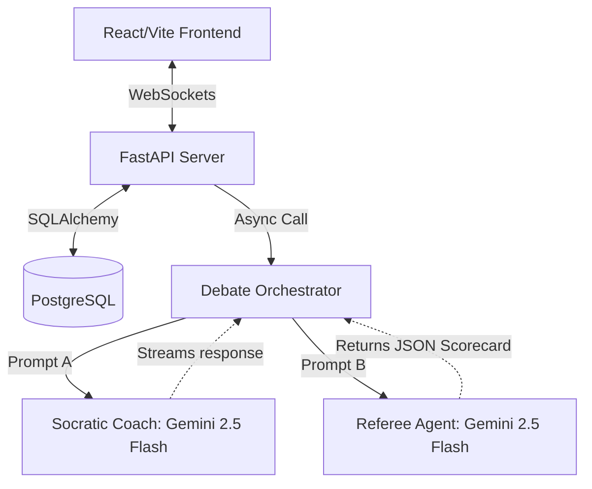

# Echo-Chamber Breaker 

**A multi-agent AI system that uses Socratic debate and real-time fallacy detection to challenge your strongest beliefs.**

Echo-Chamber Breaker is a full-stack educational web application designed to sharpen your critical thinking and logical reasoning. Instead of an AI that simply agrees with you, this system deploys a dual-agent architecture to politely but ruthlessly question the underlying premises of your arguments while silently detecting your logical fallacies in real-time.

---

## Architecture

1. **The Socratic AI Coach (Gemini 2.5 Flash):** The primary debater that uses the Socratic method to challenge the user's claims.
2. **The Referee Agent (Gemini 2.5 Flash):** A secondary agent that runs asynchronously to evaluate the user's messages for logical fallacies (e.g., Ad Hominem, Strawman) and scores their "Argument Strength" in real-time.



---

## Tech Stack

* **Frontend:** React (Vite), TypeScript, Tailwind/Vanilla CSS, Firebase Auth
* **Backend:** Python, FastAPI, WebSockets, asyncio, Neon (PostgreSQL)
* **AI Provider:** Google Gemini API (Gemini 2.5 Flash)
* **Deployment:** Vercel (Frontend & Serverless Backend)

---

## Local Setup Instructions

Follow these instructions to run the project locally on your machine.

### Prerequisites
* **Node.js** (v18 or higher)
* **Python** (v3.9 or higher)
* **Google Gemini API Key** ([Get one here in Google AI Studio](https://aistudio.google.com/))
* **Firebase Project** (for authentication)

### 1. Backend Setup (FastAPI)

1. Open a terminal and navigate to the `backend` directory:
   ```bash
   cd backend
   ```
2. (Optional but recommended) Create and activate a Python virtual environment:
   ```bash
   python -m venv .venv
   # Windows
   .venv\Scripts\activate
   # Mac/Linux
   source .venv/bin/activate
   ```
3. Install the required Python dependencies:
   ```bash
   pip install -r requirements.txt
   ```
4. Create a `.env` file in the `backend` directory and add your API keys. You will need a Google Gemini API Key and a database URL (e.g., PostgreSQL):
   ```env
   GEMINI_API_KEY="your_google_gemini_api_key"
   DATABASE_URL="your_database_connection_string"
   ```
5. Start the FastAPI development server using Uvicorn:
   ```bash
   python main.py
   # OR
   uvicorn main:app --reload --host 0.0.0.0 --port 8000
   ```
   *The backend will now be running on `http://localhost:8000`.*

### 2. Frontend Setup (React/Vite)

1. Open a *new* terminal window and navigate to the `frontend` directory:
   ```bash
   cd frontend
   ```
2. Install the Node.js dependencies:
   ```bash
   npm install
   ```
3. Create a `.env.local` file in the `frontend` directory and add your Firebase configuration and the backend API URL:
   ```env
   VITE_FIREBASE_API_KEY="your_firebase_api_key"
   VITE_FIREBASE_AUTH_DOMAIN="your_firebase_auth_domain"
   VITE_FIREBASE_PROJECT_ID="your_firebase_project_id"
   VITE_FIREBASE_STORAGE_BUCKET="your_firebase_storage_bucket"
   VITE_FIREBASE_MESSAGING_SENDER_ID="your_firebase_sender_id"
   VITE_FIREBASE_APP_ID="your_firebase_app_id"
   VITE_API_URL="http://localhost:8000"
   ```
4. Start the Vite development server:
   ```bash
   npm run dev
   ```
   *The frontend will now be accessible at `http://localhost:5173`.*

---

## How to Use

1. Open the frontend in your browser (`http://localhost:5173`).
2. Log in using Firebase authentication (Google or Email/Password).
3. Type a controversial statement (e.g., "AI will replace all software engineers").
4. Wait for the **Socratic Coach** to stream a response.
6. Click the "Export PDF" button to download a beautifully formatted transcript of your debate.

---

## Deployment Instructions

To reproduce the live deployment, you will need accounts on **Render** (for the backend) and **Vercel** (for the frontend).

### Backend (Render)
1. Push your repository to GitHub.
2. Log into Render and click **New+** > **Web Service**.
3. Connect your GitHub repository.
4. Render will automatically detect the Python environment. Set the build command to `pip install -r requirements.txt` and the start command to `uvicorn main:app --host 0.0.0.0 --port $PORT`.
5. Under the **Environment** tab, add your secrets: `DATABASE_URL` and `GEMINI_API_KEY`.
6. Click Deploy. (Note: The `.python-version` file ensures Render uses stable Python 3.11).

### Frontend (Vercel)
1. Log into Vercel and click **Add New** > **Project**.
2. Connect your GitHub repository and select the `frontend` directory as the Root Directory.
3. Vercel will automatically detect the Vite framework.
4. Under **Environment Variables**, add all your `VITE_FIREBASE_*` variables and set `VITE_API_URL` to your newly deployed Render backend URL (e.g., `https://echo-chamber-backend.onrender.com`).
5. Click **Deploy**.
